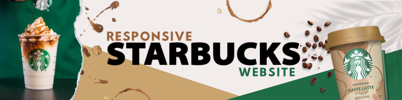

  
  

Welcome to Starbucks Online, your digital destination for all things coffee! 𓍢ִ໋☕️✧˚ ༘ ⋆

***

## 📍 Overview

***Abstract***

The "Starbucks" website project is a web-based platform that brings the cozy ambiance of a Starbucks coffeehouse to life virtually. Customers are the target audience for this website, which is meant to support and encourage them to purchase Starbucks products. Users may engage with the website in an excellent way with the dynamic animation and effects applied in all areas. Featured on the website are new and best-selling products from the menu, well-organized product categories, rewards for returning customers, and a flexible page layout. Regardless of your expertise in web design or not, this Starbucks-themed website streamlines the ordering process with an excellent user experience and web design.

**Visit the website:** [pervolarakis.github.io/starbucks-voucher/](pervolarakis.github.io/starbucks-voucher/)

## 👾 DemoScreenshots/Demo

    

    

    

## 🧩 Features

1. Responsive Design
      - Our website easily adapts to offer the optimal viewing experience on any device, be it a laptop, tablet, or smartphone.

2. Interactive Features
    - Each element enhances the user experience by enticing exploration and engagement, from subtle micro-interactions to amusing cascade effects.

3. Integrated Navigation
    - Well transition between sections. Every graphic takes users to a different section of the website in an easy-to-understand manner.

4. Appealing Animations
    - Well transition between sections. Every graphic takes users to a different section of the website in an easy-to-understand manner.

## 📕 Authors

- **Lady Diane Casilang**
- **Patrick Belarmino**
- **Joana Ester Reyes**
- **Krisziah Vinoya**

